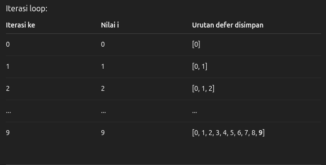

# ⋆.˚🦋༘⋆ GO TOUR CAHYA CUTY ᯓ★
#
#
## 2. Flow Control ✮⋆˙
# 
### For Loop ✮⋆˙
```azure
Go hanya punya satu perintah perulangan yaitu "for".
Example:
for i := 0; i < 5; i++ {
    fmt.Println(i)
}
```
#
#
### For Continued ✮⋆˙
```azure
func main() {
	sum := 1
	for ; sum < 1000; {
		sum += sum
	}
	fmt.Println(sum)
}
```
#
#
### For as While ✮⋆˙
```azure
for condition {
    // kode yang dijalankan selama kondisi benar
}

example:
func main() {
	sum := 1
	for sum < 1000 {
		sum += sum
	}
	fmt.Println(sum)
}

Untuk menghentikan perulangan sama aja pakai "break" atau "return".
```
# 
#
### IF Statement ✮⋆˙
```azure
if kondisi {
    // kode yang dijalankan jika kondisi benar
} else {
    // kode yang dijalankan jika kondisi salah
}

example:
func main() {
    x := 10
    if x%2 == 0 {
        fmt.Println("Genap")
    } else {
        fmt.Println("Ganjil")
    }
}
```
#
#
### IF with a short statement ✮⋆˙
```azure
if statement; kondisi {
    // kode yang dijalankan jika kondisi benar
} else {
    // kode yang dijalankan jika kondisi salah
}

example:
func main() {
    if x := compute(); x < 0 {
        fmt.Println("Negatif")
    } else {
        fmt.Println("Positif atau Nol")
    }
```
#
#
### Switch ✮⋆˙
```azure
Perintah Switch untuk mempermudah membuat beberapa perintah kondisi if-else.
Go akan menjalankan case pertama yang nilainya sama dengan ekspresi kondisi yang diberikan.
Hanya saja di GO akan menjalankan case yang terpilih saja,
bukan semua case yang ada selanjutnya.

Example:

func main() {
	angka := 2

	switch angka {
	case 1:
        fmt.Println("Satu")
	case 2:
        fmt.Println("Dua")
	case 3:
        fmt.Println("Tiga")
    default:
        fmt.Println("Angka tidak dikenal")
	}
}

Bedanya dengan case pada bahasa lain, Go tidak memerlukan perintah "break" di setiap case.
Bahasa lain harus menambahkan "break" agar tidak lanjut ke case berikutnya.
```
#
#
### Switch evaluation order ✮⋆˙
```azure
Switch di Go dievaluasi dari atas ke bawah.
Jika ada beberapa case yang cocok, hanya case pertama yang akan dijalankan.
Jadi dia tidak akan lanjut turun ke case berikutnya.
```
#
#
### Switch with no condition ✮⋆˙
```azure
Switch juga bisa digunakan tanpa kondisi.
Dalam hal ini, setiap case dievaluasi sebagai ekspresi boolean.

Example:
    func main() {
	t := time.Now()
	switch {
	    case t.Hour() < 12:
            fmt.Println("Good morning!")
	    case t.Hour() < 17:
            fmt.Println("Good afternoon.")
        default:
        fmt.Println("Good evening.")
	}
}
```

*Switch dengan kondisi vs Switch tanpa kondisi*
```go
Switch dengan kondisi membandingkan nilai ekspresi dengan nilai case
Cocok untuk membandingkan satu nilai tertentu.

Switch tanpa kondisi mengevaluasi setiap case sebagai ekspresi boolean
Cocok untuk memeriksa beberapa kondisi yang berbeda.
```
#
#
### Defer ✮⋆˙
```azure
Perintah defer digunakan untuk menunda eksekusi dari sebuah fungsi sampai fungsi yang melingkupinya selesai.

Example:
func main() {
	defer fmt.Println("world")

	fmt.Println("hello")
	fmt.Println("cahya")
}

Output:
hello
cahya
world
```
#
#
### Stacking defers (Penundaan bertumpuk) ✮⋆˙
```azure
Penundaan bertumpuk berarti yang terakhir masuk akan menjadi yang petama keluar (LIFO - Last In First Out).
Example:
    func main() {
	fmt.Println("counting")

	for i := 0; i < 10; i++ {
		defer fmt.Println(i)
	}

	fmt.Println("done")
}
	
Output:
counting
done
9
8
7
6
5
4
3
2
1
0
```
> 
>> Jadi semua deferred print dijalankan mulai dari yang terakhir disimpan.

